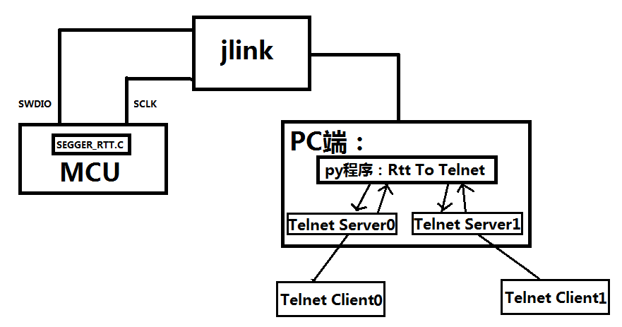
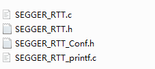
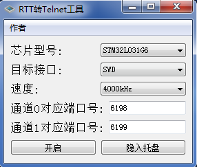
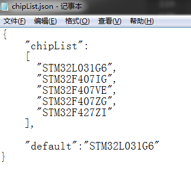
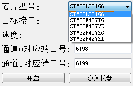
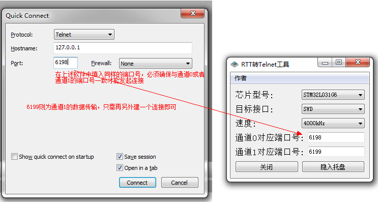
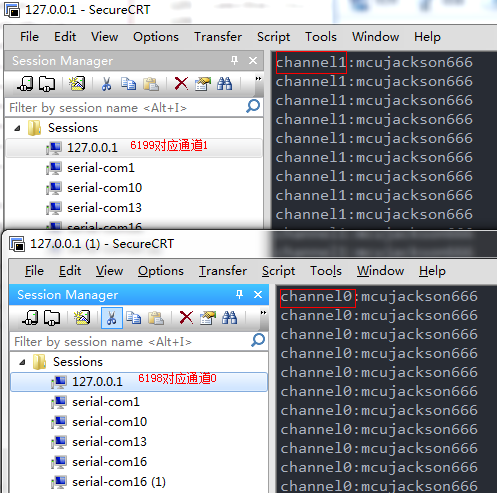
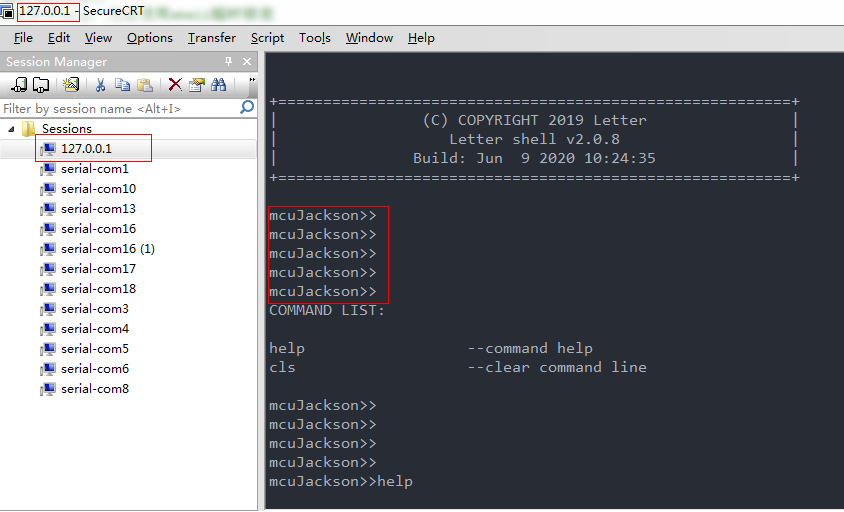

# SEGGER_RTT To Telnet  

-- 通过Telnet 转发 SEGGER_RTT 数据

mcujackson

适用于能通过JLink调试的嵌入式芯片，支持SEGGER_RTT 通道0 和 通道1,支持多种目标接口
包括但不限于以下目标接口类型:SWD、JTAG、CJTAG、FINE，连接速度可选，两路telnet服务器端口号可选

## 1 简述

### 1.1 背景

在项目调试过程中，遇到串口较少的芯片，除去必须用作与其他外设通讯的串口外，已无剩下可用作调试打印的串口。另外，每次整机调试不仅需要携带j-link 或 st-link此类的烧录工具外，还需要携带串口线用作调试输出，而且大多数情况，为了保证调试串口的问题，许多公司都将芯片输出ttl电平接入RS-232 或 485电平转换芯片转换，使用十分不便，所以开发此工具，用SEGGER_RTT模拟出两路串口，只需通过telnet便可访问两路通道的数据，使用非常方便，绝大多数芯片都能完美兼容。完美解决因串口线连接不稳定而导致调试不便问题

### 1.2 实现方式

1.在工程文件里面加入SEGGER_RTT模块代码，调用读写函数就可以将指定的数据发送给J-link的RTT
2.利用本软件开启telnet服务器，并读取指定通道的RTT数据，将数据转发给telnet客户端
3.从客户端读取用户输入的信息，将数据转发给j-link的RTT，再由RTT将数据送入嵌入式设备中

  

## 2 移植过程  

### 2.1 为MCU移植SEGGER_RTT模块  

首先你需要有一个j-link，在安装完驱动后，可以在C:\Program Files (x86)\SEGGER\JLink_V632f\Samples\RTT路径下找到
SEGGER_RTT_Vxxxf.zip（xxx是版本号），如果找不到该路径，可以使用搜索工具以 SEGGER_RTT 为关键字搜索，在找到SEGGER_RTT_Vxxxf.zip后，解压该压缩包，在RTT目录找到以下这四个文件
  

不过，由于SEGGER_RTT有多个版本，高版本的api做的比较好，所以建议直接用我在工程提供的模块包即可，以上只是说明若有新版本更新，如何去移植最新的版本

将这四个文件加入到代码工程中，没出问题的话，你可以正常编译通过，无需修改任何代码，但SEGGER_RTT提供的这部分的代码只实现通道0的数据收发，并没有实现通道1。
所以如果想使用通道1，需要在此基础上进行通道的添加，以下为调用提供的api配置的通道1

```c
#include "SEGGER_RTT.h"
char rttLogWriteBuffer[512];
char rttLogReadBuffer[512];
void rttLogInit(void)
{
    //调用SEGGER_RTT的api，配置通道1，若只用作日志输出，可不配置读缓冲，减少RAM空间
    //其中 1 代表通道1 ，rttLogWriteBuffer为该缓冲区的写buffer，512为该buffer的大小,"Log"代表通道1的名字
    SEGGER_RTT_ConfigUpBuffer(1, "Log", rttLogWriteBuffer, 512, SEGGER_RTT_MODE_DEFAULT);//配置写缓冲

    //rttLogReadBuffer为该缓冲区的读buffer
    SEGGER_RTT_ConfigDownBuffer(1, "Log", rttLogReadBuffer, 512, SEGGER_RTT_MODE_DEFAULT);//配置读缓冲
}
```

另外可根据需求修改通道0的缓冲区带下，在#include "SEGGER_RTT_Conf.h"，个人修改为512，基本满足数据收发需求

```c
 #define BUFFER_SIZE_UP                            (512)  // Size of the buffer for terminal output of target, up to host (Default: 1k)
 #define BUFFER_SIZE_DOWN                          (512)    // Size of the buffer for terminal input to target from host (Usually keyboard input) (Default: 16)
 ```

至此，SEGGER_RTT 模块就简单的移植完成了
为了方便测试，在main.c函数中需要调用SEGGER_RTT的发送函数当做测试，可以使用  
SEGGER_RTT_printf(unsigned BufferIndex, const char * sFormat, ...);
BufferIndex代表通道号，后面的填写跟printf一模一样（不过对浮点型的支持似乎不是那么好，有兴趣的同学可以多试试
个人的例子是用它所提供的写函数

```c
  while (1)
  {
     while (SEGGER_RTT_GetAvailWriteSpace(0) < 24)//判断通道 0 写buffer是否有足够的空间写
     {
        HAL_Delay(1);//你自己的延迟函数
     }
     SEGGER_RTT_Write(0, "channel0:mcujackson666\r\n", 24);//将数据发送

     while (SEGGER_RTT_GetAvailWriteSpace(1) < 23)//判断通道 1 写buffer是否有足够的空间写
     {
        HAL_Delay(1);//你自己的延迟函数
     }
     SEGGER_RTT_Write(1, "channel1:mcujackson666\r\n", 24);//将数据发送
     HAL_Delay(1000);
  }
 ```  

### 2.2 使用RTT 转 Telnet工具 生成两个通道的Telnet服务  


  
1.首先打开工程目录下的chipList.json  
这是一个json格式的文件，可以将自己常用的芯片型号添加进列表中，如果加上逗号哦，不然程序解析错误可能会出现奔溃的情况，还可以将  "default":"STM32L031G6"  修改为自己最常用的芯片型号，这样在程序打开的时候就会直接选择该型号的芯片





若无需修改端口，直接点击开启按钮即可

### 2.3 使用SecureCRT登录Telnet服务器  

1.如果在本机开启该软件，可以用直接用127.0.0.1的地址范围，如下图




## 3 结合Shell使用

暂无，后续会进行补充
有兴趣的同学可以使用letter大神写的嵌入式shell  

https://github.com/NevermindZZT/letter-shell  

结合本软件可以实现比较实用的调试功能，下面先放一张效果图  



## 4 修改记录

2020/06/09 1.0

- 第一次提交
